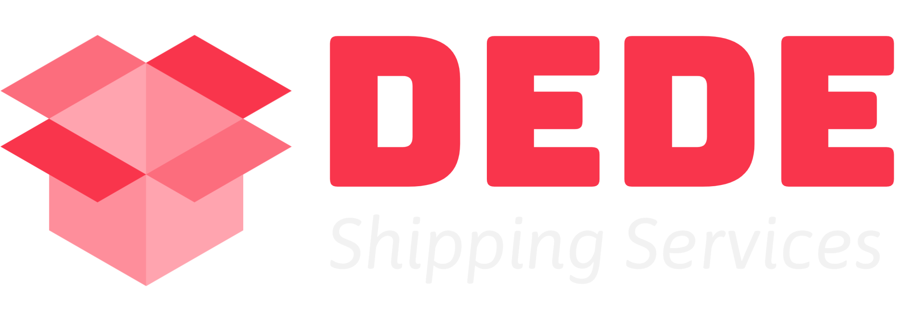

<!-- PROJECT SHIELDS -->

[](https://github.com/arquisoft/dede_en2a/actions)
[](https://sonarcloud.io/summary/new_code?id=Arquisoft_dede_en2a)
[](https://codecov.io/gh/Arquisoft/dede_en2a)

<!-- PROJECT LOGO -->

<br />
<div align="center">
  <a href="https://www.dedeen2a.tk/">
    
  </a>

<h3 align="center">dede_en2a</h3>

  <p align="center">
    We are creating an app for you to order the products you want - as in any other site - with privacy in mind
    <br />
    <a href="https://arquisoft.github.io/dede_en2a/"><strong>Explore the docs »</strong></a>
    <br />
    <br />
    <a href="https://www.dedeen2a.tk/">View Demo</a>
    ·
    <a href="https://www.youtube.com/watch?v=4LG93JEGACs">Promotional video</a>
    ·
    <a href="https://github.com/Arquisoft/dede_en2a/issues">Report Bug</a>
    ·
    <a href="https://github.com/Arquisoft/dede_en2a/issues">Request Feature</a>
  </p>
</div>

<!-- TABLE OF CONTENTS -->
<details>
  <summary>Table of Contents</summary>
  <ol>
    <li>
      <a href="#🤔-about-the-project">About The Project</a>
      <ul>
        <li><a href="#🚧-built-with">Built With</a></li>
      </ul>
    </li>
    <li>
      <a href="#🔨-using-the-app">About The Project</a>
      <ul>
        <a href="#💸-paypal-account-for-testing-the-application">PayPal account for testing the application</a>
      </ul>
    </li>
    <li>
      <a href="#🏁-getting-started">Getting Started</a>
    </li>
        <li>
      <a href="#ℹ️-more-information">More Information</a>
    </li>
    <li><a href="#✉️-contact">Contact</a></li>
  </ol>
</details>

<!-- ABOUT THE PROJECT -->

## 🤔 About The Project


A _privacy aware retail company_ wants to create an online retail system called DeDe (Decentralized Delivery) that preserves the **privacy** of the customers following the [SOLID principles](https://solidproject.org/).

In order to do that, the system will not store personal information from customers but will obtain that information from the user’s pods given that the users give the necessary permissions to the shopping system.

<p align="right">(<a href="#top">back to top</a>)</p>

### 🚧 Built With

- [TypeScript](https://www.typescriptlang.org/)
- [Node.js](https://nodejs.org/es/)
- [React.js](https://reactjs.org/)
- [SOLID Pods](https://solidproject.org/)
- [MUI Core](https://mui.com/)
- [Docker](https://www.docker.com/)
- [MongoDB](https://www.mongodb.com/)
- [Mongoose.js](https://mongoosejs.com/)

<p align="right">(<a href="#top">back to top</a>)</p>

<!-- USING THE APP -->

## 🔨 Using the app

### 💸 PayPal account for testing the application

#### PayPal account

- _User e-mail_: dedeen2a@gmail.com
- _Password_: dedeen2a

#### Credit Card for testing

- _Card Type_: MasterCard
- _Card Number_: 5110926992639155
- _Expiration Date_: 05/2027
- _CVV_: 664

<p align="right">(<a href="#top">back to top</a>)</p>

<!-- GETTING STARTED -->

## 🏁 Getting started

<mark>In case you already have node.js and npm, make sure you update them before attempting to build the images</mark>

If you want to execute the project you will need [git](https://git-scm.com/downloads), [Node.js and npm](https://www.npmjs.com/get-npm) and [Docker](https://docs.docker.com/get-docker/). Make sure the three of them are installed in your system. Download the project with `git clone https://github.com/arquisoft/dede_0`. The fastest way to launch everything is with docker:

```bash
docker-compose up --build
```

This will create two docker images as they don't exist in your system (the webapp and the restapi) and launch a mongo container database. It will also launch Prometheus and Grafana containers to monitor the webservice. You should be able to access everything from here:

- [Webapp - http://localhost:3000](http://localhost:3000)
- [RestApi example call - http://localhost:5000/products](http://localhost:5000/products)
- [RestApi raw metrics - http://localhost:5000/metrics](http://localhost:5000/metrics)
- [Prometheus server - http://localhost:9090](http://localhost:9090)
- [Grafana server http://localhost:9091](http://localhost:9091)

If you want to run it without docker. Compile and run the restapi:

```shell
cd restapi
npm install
npm start
```

Now the webapp:

```shell
cd webapp
npm install
npm start
```

You should be able to access the application in [http://localhost:3000](http://localhost:3000).

<p align="right">(<a href="#top">back to top</a>)</p>

## ℹ️ More information

You can get more information about the repository in the other _README_ files:

- [Documentation](https://github.com/arquisoft/dede_en2a/tree/master/docs)
- [webapp](https://github.com/arquisoft/dede_en2a/tree/master/webapp)
- [restAPI](https://github.com/arquisoft/dede_en2a/tree/master/restapi)

<p align="right">(<a href="#top">back to top</a>)</p>

## ✉️ Contact

Álvaro Rodríguez González - UO277776

Pablo Lopez Amado - UO271580

Andrés Martínez Rodríguez - UO277915

Ángel Iglesias Préstamo - UO270534

Noelia Iglesias Cuesta - UO269652

<p align="right">(<a href="#top">back to top</a>)</p>
